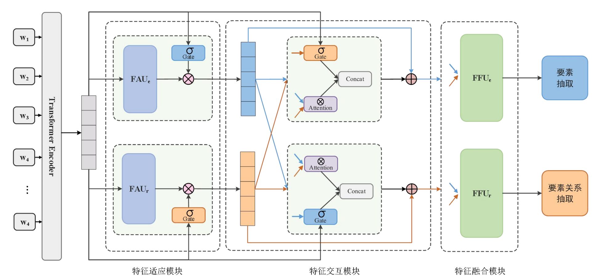

# TCRE

This repository contains codes for the paper:"Task-Collaboration Representation Enhanced Joint Extraction Model for Element and Relationship"


## Model Overview

### Framework


In this work, we present a new framework equipped with a novel recurrent encoder named **partition
filter encoder** designed for multi-task learning.


## Preparation

### Environment Setup
The experiments were performed using one single NVIDIA-RTX3090 GPU. The dependency packages can be installed with the command:
```
pip install -r requirements.txt
```
Other configurations we use are:  
* python == 3.7.10
* cuda == 11.1
* cudnn == 8


### Data Acquisition and Preprocessing
This is the first work that covers all the mainstream English datasets for evaluation, including **ACE05**, **ACE04**, **SCIERC**. 

Please follow the instructions of reademe.md in each dataset folder in ./data/ for data acquisition and preprocessing.  


**---Performance comparison in SciERC**


| Model          |   NER       | RE        |
| ----------     |   --------- | --------- |
| **PFN**        |   66.8      | 38.4      |
| **PFN-nested** |   67.9      | 38.7      |


## Quick Start

### Model Training
The training command-line is listed below (command for CONLL04 is in [Evaluation on CoNLL04](#Evaluation-on-CoNLL04)):  
```
python main.py \
--data ${ACE2005/ACE2004/SCIERC} \
--do_train \
--do_eval \
--embed_mode ${albert/scibert} \
--batch_size ${12 (for most datasets) /4 (for SCIERC)} \
--lr ${1e-5} \
--output_file ${the name of your output files, e.g. ace_test} \
--eval_metric ${micro} 
```

After training, you will obtain three files in the ./save/${output_file}/ directory:     
  * **${output_file}.log** records the logging information.  
  * **${output_file}.txt** records loss, NER and RE results of dev set and test set for each epoch.  
  * **${output_file}.pt** is the saved model with best average F1 results of NER and RE in the dev set.  


### Evaluation on Pre-trained Model

The evaluation command-line is listed as follows:

```
python eval.py \
--data ${ACE2005/ACE2004/SCIERC} \
--eval_metric ${micro} \
--model_file ${the path of saved model you want to evaluate. e.g. save/ace_test.pt} \
--embed_mode ${albert/scibert}
```

## Pre-trained Models and Training Logs

### Download Links
Due to limited space in google drive, 10-fold model checkpoints of ADE are not available to you.  


| Dataset               |  File Size | Embedding          | Download                                                                                   |
| --------------------- |  --------- | ----------------   | ------------------------------------------------------------------------------------------ |
| **ACE05**             |  815MB     | Albert-xxlarge-v1  | [Link](https://drive.google.com/file/d/17HcLawF23rZEhWl-6QtN9hg8HMvR4Imf/view?usp=sharing) |
| **ACE04**             |  3.98GB    | Albert-xxlarge-v1  | [Link](https://drive.google.com/file/d/1ViTsEvprcouGozdVqZahtgtg1WNzvQci/view?usp=sharing) |
| **SciERC**            |  399MB     | Scibert-uncased    | [Link](https://drive.google.com/file/d/1KsWRstdhrX0IDpnDqFUi6NAlnlmzlekI/view?usp=sharing) |


### Result Display
| Dataset    |  Embedding         | Evaluation Metric | NER       | RE        | 
| ---------- |  ---------         | ----------------- | --------- | --------- |
| **ACE05**  |  Albert-xxlarge-v1 |Micro              | 89.0      | 66.8      |
| **ACE04**  |  Albert-xxlarge-v1 |Micro              | 89.3      | 62.5      |
| **SciERC** |  Scibert-uncased   |Micro              | 66.8      | 38.4      |


F1 results on ACE04:
| 5-fold     |  0    |  1  | 2   | 3     |  4      | Average |
| ---------- |  ---- |---- |---- |------ | ------- | ------- |
| Albert-NER |  89.7 |89.9 |89.5 |89.7   |  87.6   | 89.3    |
| Albert-RE  |  65.5 |61.4 |63.4 |61.5   |  60.7   | 62.5    |


## Extension on Ablation Study
As requested, we release ablation NER/RE results of 5 runs in the category of encoding scheme and decoding strategy.

| Model/seed |  0         |  1       | 2        | 3          |  4         | Mean       | Standard Deviation | 
| ---------- |  --------- |--------- |--------- |----------- | ---------- | ---------- |--------------------|
| Original   | 66.8/38.4  |66.9/36.9 |66.4/36.3 |68.0/38.9   | 67.7/37.7  | 67.2/37.6  | 0.67/1.06          |
| Sequential | 68.7/36.9  |68.0/35.9 |68.5/34.8 |67.7/36.9   | 67.0/36.2  | 68.0/36.1  | 0.68/0.87          |
| Parallel   | 67.0/35.1  |67.2/36.6 |67.9/37.4 |68.0/37.9   | 66.9/34.6  | 67.4/36.3  | 0.51/1.43          |
| Selective  | 68.1/37.4  |67.0/35.9 |67.5/38.5 |66.8/35.1   | 67.7/36.7  | 67.4/36.7  | 0.53/1.32          |

